 

    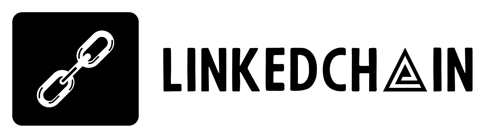

 

 [Introduction](#introduction)  
 [Goals and motivations](#goals-and-motivations)  
 [How to run](#how-to-run)  
 [Roadmap](#roadmap)  
 [Domain](#domain)  
 [Architecture](#architecture)  
 [Contact](#contact)  

  
  

# Introduction

LinkedChain is a web application that is a kind of extension of the functionality of the LinkedIn platform through the use of blockchain technology. The project aims to make it easier to create and manage employer-employee relationships and build a trusted reputation in the business community.

### Application parts and technologies used:

| Application | Technologies |
| --- | --- |
| Backend |    |
| Frontend |   |
| Blockchain |   |

 

### Why Blockchain?

- **Data immutability:** Once the data is placed on the blockchain, it is permanent and cannot be changed or deleted without the consent of the majority of network participants. This ensures that data related to employee-employer relationships is authentic and immutable

- **Transparency and credibility:** The decentralised nature of blockchain means that all participants in the network have access to the same data, ensuring transparency and trust in the process

- **Autonomy:** Blockchain enables the automation of many processes through smart contracts, which are computer programs that run on the blockchain. These can be used to automatically record events

- **Data security:** Blockchain provides a high level of data security through the use of a cryptographic algorithm and the distributed nature of the network. Each block of data is linked to the previous one through complex cryptographic functions, making it difficult to alter or forge data

 

### Why Linkedin?

- **Application purpose:** It is not intended to be a competitor to Linkedin, but rather an extension of its functionality

- **Business connections:** In the application described, which aims to establish an employee-employer relationship, LinkedIn is a natural choice because of its business relevance and representation of professional networks

- **User Credibility:** Using LinkedIn accounts for authentication can provide greater credibility to users. Because information on LinkedIn is often verified and more difficult to fake than on other social media platforms such as Facebook and Twitter, authentication through LinkedIn can minimize the risk of fake profiles

- **Minimize data duplication:** LinkedIn contains a wealth of information that can be useful in the context of an application, such as work experience, skills or education. Using LinkedIn authentication, an application can access this data without requiring users to re-enter it, minimizing data duplication and streamlining the registration process

- **Simplified registration process:** Users often prefer a quick and convenient registration process. Authentication via LinkedIn can simplify this process by eliminating the need for users to enter new information or create a new account; they simply sign in using their existing LinkedIn account

 

### References to design sites:

|     | Name | Url
| --- | --- | --- |
|  | Domain & EventStorming | [CLICK](https://miro.com/app/board/uXjVNmXpFqM=/?share_link_id=366548857143) |
|  | Github Project Section | [CLICK](https://github.com/users/Cwirek95/projects/2) |
| -3daee4?style=for-the-badge&) | Architecture Decision Records | [CLICK](https://github.com/Cwirek95/LinkedChain/tree/master/docs/ArchitectureDecisionLog) |

 
 

# Goals and motivations

### Business goals:

- **Verification and Guarantee of Employment:** Creating a tool that allows companies and employees to verify their employment history in an unquestionable and immutable way through the use of blockchain technology. This provides both employers and employees with confidence in the reliability of employment information

- **Trust and Authenticity of Reviews:** Today's review platforms are often vulnerable to fake reviews or manipulation. I wanted to create a system where reviews about employers and employees are based on real experiences, ensuring the integrity and credibility of the reviews

- **Streamlining Recruitment Processes:** With the ability to verify employment history via blockchain, the application can significantly streamline recruitment processes for employers and increase their efficiency by eliminating the need for manual data verification

- **Increasing Employee Engagement:** With the ability to build a reputation and receive honest reviews, employees may feel more motivated to engage in their work, potentially leading to increased employee retention

- **Promoting Fair Competition:** By providing the ability to prove the authenticity of references and reviews, the application can promote fair competition in the labour market, rewarding commitment and competence

 

### Development motivations:

- **Development in DDD approach:** My goal is to deepen my knowledge and experience in Domain Driven Design (DDD), as I believe it is a key approach to building scalable and flexible applications

- **Exploring the Blockchain sector:** Despite my limited experience with blockchain technology, I am intrigued by its potential applications and would like to learn more about its practical applications. Building an application using blockchain will give me hands-on experience in integrating with blockchain, creating and implementing smart contracts, and solving security and scalability challenges

- **Working with Frontend technologies**: I also intend to expand my skills in front-end programming, with a particular focus on Angular, one of the most popular frameworks for developing advanced web applications. Working with Angular will allow me to learn best practices for creating responsive and interactive user interfaces, and to understand frontend-backend integration in the context of a web application

 
 

# How to run

### Non-Blockchain version

Will be available as soon as the backend part of the application is completed....

### Non-GUI version

Will be available as soon as the blockchain part of the application is completed....

### Full version

Will be available as soon as the fronted part of the application is completed....

 
 

# Roadmap

The entire plan for my application is continuously updated in the [Projects](https://github.com/users/Cwirek95/projects/2) section

 

### The Priority Levels:

| Priority | Description
| --- | --- |
|  | These tasks are the necessary foundation of the application's operation. They are indispensable elements that ensure the proper functioning of the application's business logic. Their implementation is necessary to achieve the main functionality of the system |
| | Medium priority tasks are not directly related to the core business logic, but add additional features or enhancements that improve the overall user experience. They will only be completed if there is enough time left before the project deadline |
|  | Low-priority tasks are not essential to the application and do not directly affect its core business logic. They typically involve minor improvements, cosmetic UI changes, or other optional features |

 

### First stage:

**Deadline:** 08.06.2024 (until the end of the 100commitow competition)

The main goal of the first phase of the project, prepared as part of the 100commitow competition, is to demonstrate the main business idea of building reliable and trustworthy labor relations based on the blockchain network. Accordingly, the main focus will be on proper design, configuration and integration of the main parts of the application. Then, simple functionalities will be added that can practically demonstrate the application of the presented business plan, i.e. the review and recommendation system.

|  | Task | Priority
| --- | --- | --- |
| S1-1 | Create a detailed description of use cases |  |
| S1-2 | Define the structure of the web application and the relationships between its components |  |
| S1-3 | Develop the backend part of the application based on the DDD approach |  |
| S1-4 | Add authorization system based on Linkedin accounts |  |
| S1-5 | Create smart contracts using Rust language within the Polkadot and Substrate platform |  |
| S1-6 | Determine API interfaces for the backend and communication with the blockchain |  |
| S1-7 | Implementation of functionality related to employee-employer relations |  |
| S1-8 | Development of review and recommendation modules based on created system |  |
| S1-9 | Perform unit and integration testing for backend and blockchain parts of the application |  |
| S1-10 | Add documentation for APIs and smart contracts |   |
| S1-11 | Create the user interface using Angular |  |
| S1-12 | Perform tests for frontend applications |  |
| S1-13 | End-to-end testing, UI/UX improvements |  |
| S1-14 | Prepare a schedule for work on subsequent phases of the project |  |

 

### Backlog:

This section will be updated with more ideas and features to be implemented in the future:

- Extension of existing functionality
- Increase the level of security for blockchain transactions
- Add notification system
- Add more types of contracts
- Add contract negotiation functions
- Add more options for terminating employment
- Create administrator/moderator modules
- Add user management
- Use Event Sourcing
- Integration with other platforms
- Development of a review and recommendation module
- Add recruitment platform
- Documents management
- Storing more resources in blockchain
- Multiple language and localization support
- Adapt to different sectors and industries

 
 

# Domain

Work on the domain began with drafting key assumptions about the main business part of the application and basic functionalities that could demonstrate its practical capabilities.

    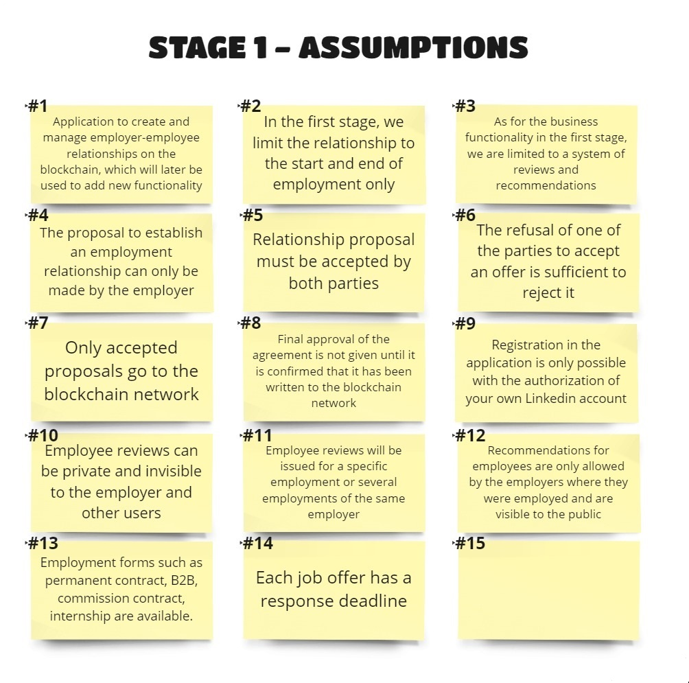

This was the basis for the next step, the business rules. They affected the entire business core of the application, as well as all the functions based on it.

    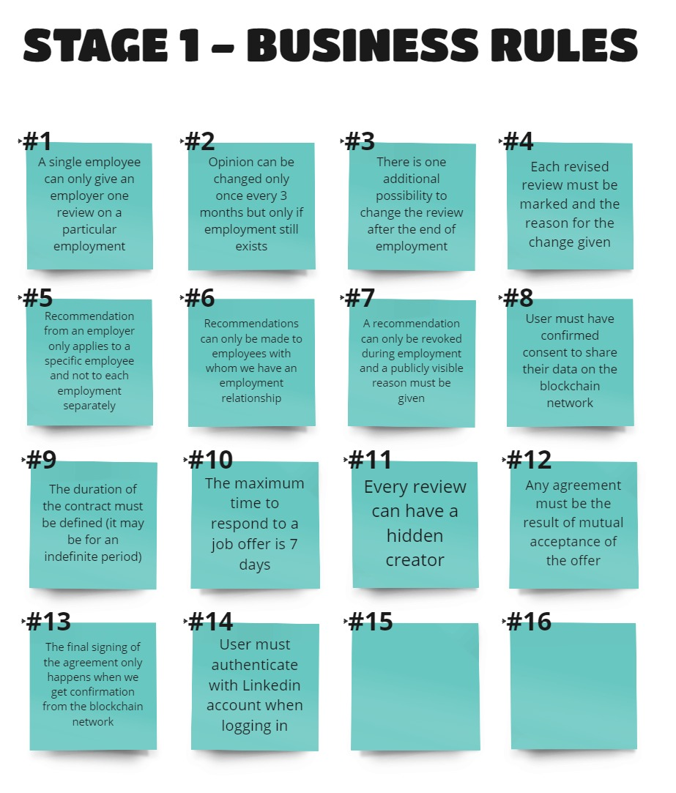

 

### Event Storming:
During the event storming process, different scenarios and interactions in the business domain were explored. This technique helped to define the boundaries of the different contexts and their tasks.

The entire modeled process is available on [MIRO](https://miro.com/app/board/uXjVNmXpFqM=/?share_link_id=366548857143).
 
Here are some sample processes:

    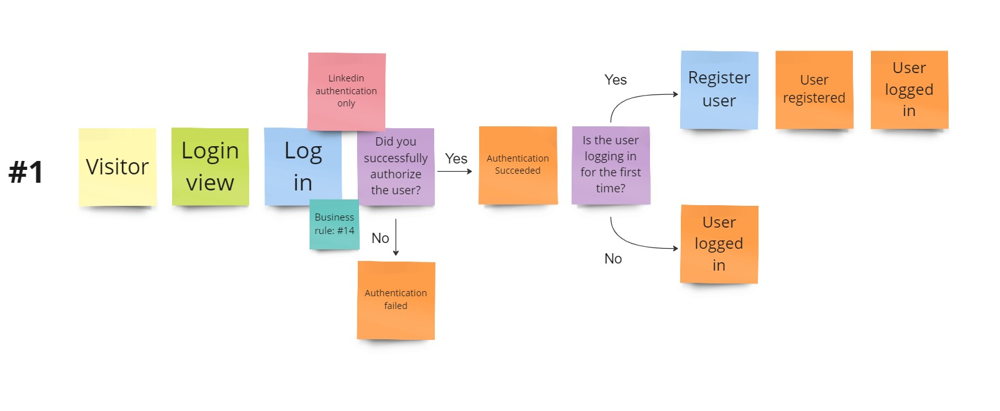

    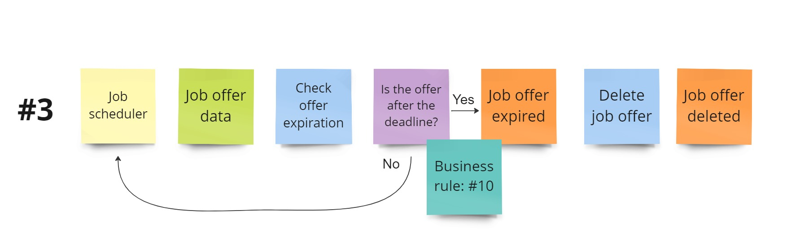

    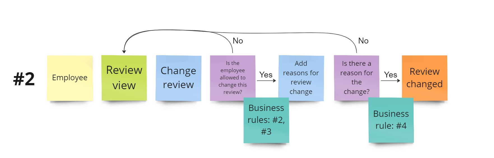

    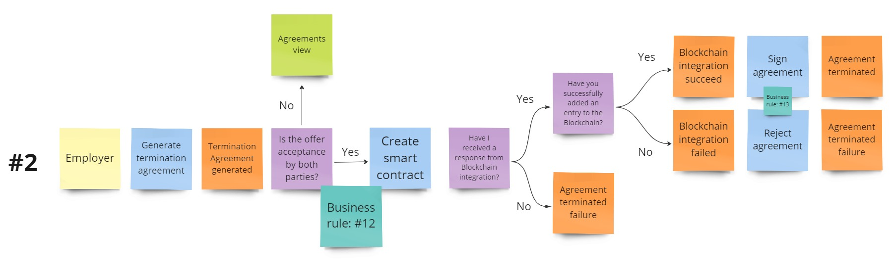

 

### Subdomains:

A number of key subdomains have been identified that are crucial for effective application management and development. Each subdomain has been carefully extracted to ensure clarity and precision in operation.

    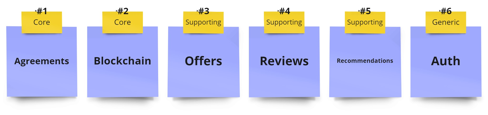

    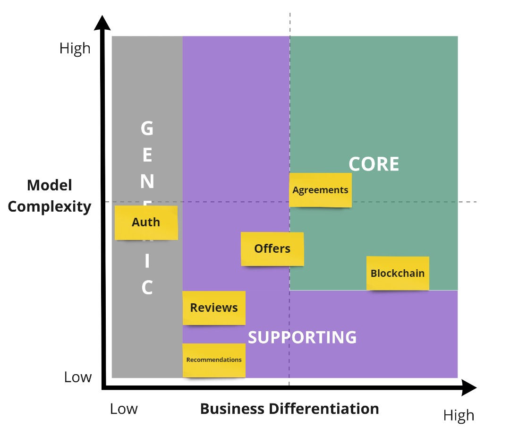

 

### Bounded Contexts:
The result of this work is the final form of bounded contexts that provide clarity and efficiency in action. Each context is well defined, allowing for clear separation of responsibilities and avoiding unnecessary conflicts.

    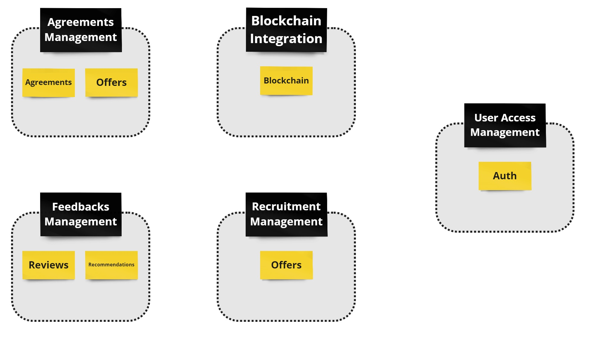

 
 

# Architecture

The application is divided into 3 main parts that are built using completely different technologies.
- The business part in .NET
- User interface in Angular
- Blockchain using Rust, Subsrate and Polkadot

### General concept for the different parts of the system:

    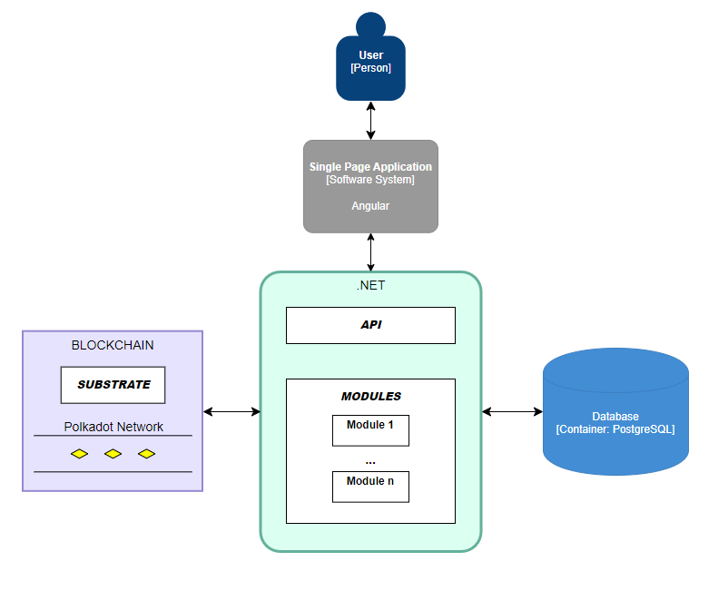

 

### Architecture of the business part:

The application in .NET uses Domain-Driven Design (DDD) tactical patterns and was developed according to the Modular Monolith Architecture.

    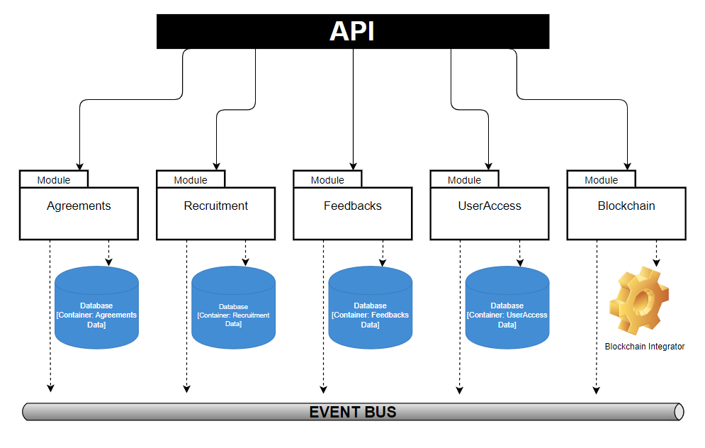

 
 

# Contact

Created by [@Cwirek95](https://github.com/Cwirek95) - feel free to contact me!  

